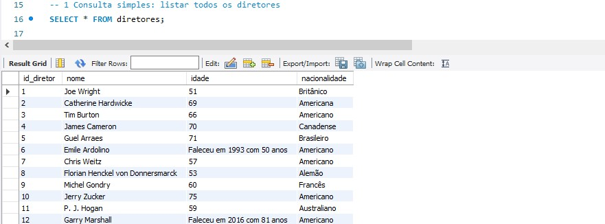
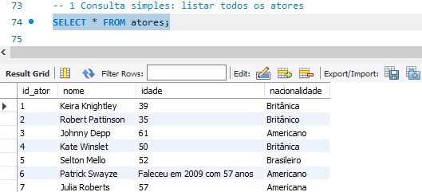
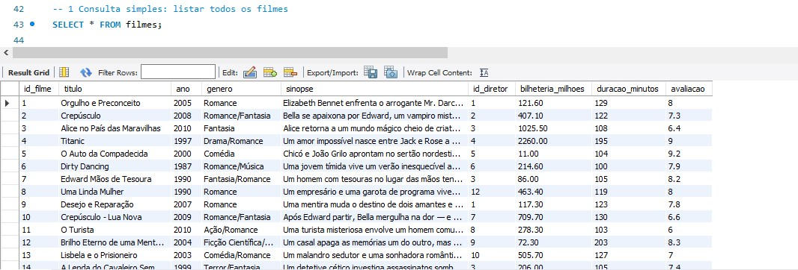
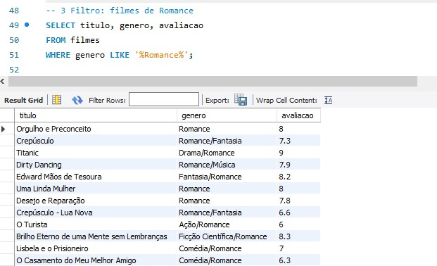
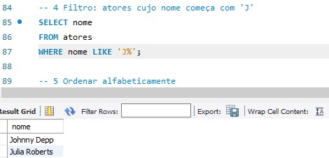
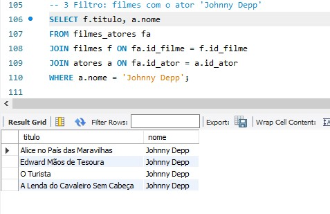
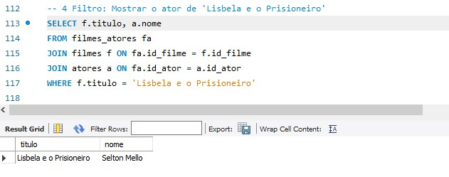
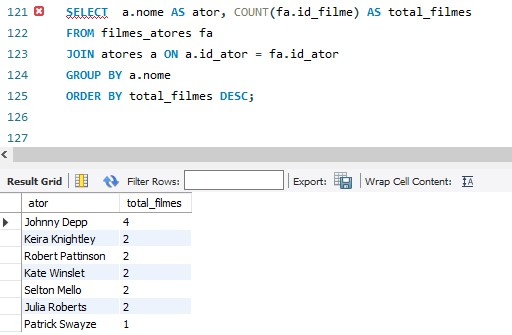

# 🎬 Biblioteca de Filmes em SQL  🎬

Um banco de dados com informações sobre os meus filmes preferidos, criado no **MySQL Workbench**.

## 💡 Objetivo
Esse projeto foi criado para fins de aprendizado,  mostrando os conhecimentos que possuo em **modelagem de dados e SQL**.

## 📁 Estrutura do Projeto:
- `biblioteca_filmes.sql` → criação das tabelas e inserção dos dados  
- `consultas_exemplos.sql` → exemplos de consultas SQL que podem gerar informações relevantes  
- `README.md` → documentação do projeto  
- Screenshots das tabelas e consultas

 ## 🧠 Sobre o Projeto  

A **Biblioteca de Filmes** contém informações completas sobre:
- 🎥 Filmes (título, gênero, bilheteria, avaliação, sinopse)
- 🎭 Atores (nome, idade e nacionalidade)
- 🎬 Diretores (dados biográficos)
- 🔗 Relação entre filmes e atores  

Com ela, é possível fazer consultas como:
- Listar todos os filmes de um ator ou diretor específico.
- Descobrir informações como idade e nascionalidade dos atores ou diretores.
- Mostrar o ano de produção dos filmes, sinopse, maior ou menor bilheteria.
- E outras consultas a mais.

## 🧩 Estrutura das Tabelas

- **filmes** → informações sobre os filmes (título, ano, gênero, bilheteria etc.)
- **atores** → dados dos atores (nome, idade, nacionalidade)
- **diretores** → informações sobre diretores
- **filmes_atores** → tabela de relacionamento entre filmes e atores

## 📸 Prints do Projeto (Mysql Workbench)

1. Consultar Tabelas - **Tabela Diretores**

**Tabela Atores**

**Tabela Filmes**

2. Consultas Simples -  **Exemplo de consulta por gênero**

**Consulta: Filmes com avaliação acima de 8**

**Consulta: Atores cujo nome começa com 'J'**

 3. Join entre Filmes e Atores -  **Consulta: Filmes com o ator Jhonny Depp**

**Consulta: Mostrar ator de filme específico**

**Consulta: Quantos filmes cada ator cadastrado fez**

 ## ⚙️ Como usar
🧩 No MySQL Workbench, conecte-se ao seu servidor local. Crie um novo schema,
importe ou copie e execute: `biblioteca_filmes.sql` depois `consultas_exemplos.sql` e rode as consultas que quiser.
Se preferir utilizar o Visual Studio Code, instale a extensão MySQL (ou SQLTools), conecte seu banco MySQL local e execute os arquivos .sql diretamente pelo terminal ou pela extensão.

## ✉️ Contato
Email: — `<wemilimaria1@gmail.com>`  
LinkedIn: `<https://www.linkedin.com/in/wemili-maria-85a02a387/>`

